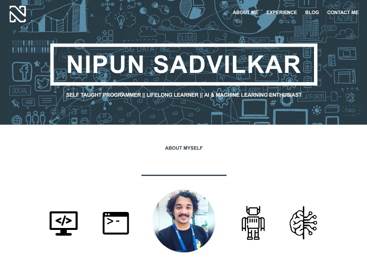

# Nipun Sadvilkar Blog

 

Live - http://nipunsadvilkar.github.io/

This site is inspired from [Travis Neilson's](https://github.com/travisneilson) (Product Interaction Designer@Google) [Devtips](https://www.youtube.com/user/DevTipsForDesigners) channel.

## How to install/use

In order to get this super fantastic [Jekyll](http://jekyllrb.com) powered template of mine follow this simple step:

* If you haven't got ruby installed on your computer, install it.
* Then run in your terminal `$ gem install jekyll`
* Move/`cd` to a folder, always in your terminal, in which you want to insert the *Artists-Theme*
* Run `git clone https://github.com/nipunsadvilkar/nipunsadvilkar.github.io.git`
* Then `cd nipunsadvilkar.github.io`
* `jekyll serve --watch`
* **DONE**

## Credits

A big thank you to [Travis Neilson's](https://github.com/travisneilson) and [Devtips](https://www.youtube.com/user/DevTipsForDesigners) channel. Keep Rocking!🤘🏻

---
